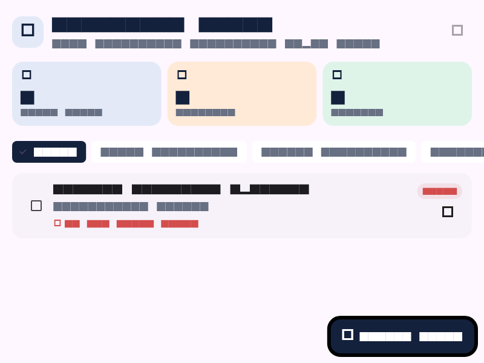

# Struktur Kode Flutter Prioritas Tugas

Dokumen ini menjelaskan isi `apps/mobile/lib` saat ini dan menilai kesesuaiannya
dengan requirement prototype UI/UX, struktur proyek, routing, dan reusable
widget.

## Struktur Folder

```text
lib/
├── main.dart
├── app.dart
├── firebase_options.dart
├── routes/
│   └── app_routes.dart
├── screens/
│   ├── login_screen.dart
│   └── dashboard_screen.dart
├── widgets/
│   └── task_form_dialog.dart
├── state/
│   └── tugas_controller.dart
├── models/
│   └── tugas.dart
├── data/
│   └── tugas_repository.dart
└── services/
    └── auth_service.dart
```

## Fungsi Setiap Bagian

- `main.dart`: entry point. Menginisialisasi Flutter dan Firebase, lalu
  menjalankan `PrioritasTugasApp`.
- `app.dart`: mengonfigurasi `MaterialApp`, tema aplikasi, dan route awal.
- `firebase_options.dart`: konfigurasi Firebase untuk platform yang didukung.
- `routes/app_routes.dart`: mendefinisikan route `/` dan `AuthGate`. Gerbang ini
  menampilkan halaman login saat belum masuk, menunggu status autentikasi, atau
  menampilkan dashboard setelah status pengguna tersedia.
- `screens/login_screen.dart`: UI masuk dan registrasi menggunakan username dan
  password. Widget utamanya bernama `AuthPage`.
- `screens/dashboard_screen.dart`: halaman daftar tugas, ringkasan jumlah
  tugas, filter status, pengurutan prioritas/deadline, dan aksi tambah, edit,
  ubah status, hapus, serta keluar. Widget utamanya bernama `BerandaPage`.
- `widgets/task_form_dialog.dart`: dialog reusable untuk menambah dan mengedit
  tugas, termasuk validasi, status submit, pemilihan deadline, dan prioritas.
- `state/tugas_controller.dart`: mengelola loading, data, error/retry,
  penyimpanan, perubahan status, dan penghapusan melalui `TugasRepository`.
- `models/tugas.dart`: model tugas dan konversi data ke/dari format map untuk
  penyimpanan.
- `data/tugas_repository.dart`: kontrak repository tugas serta implementasi
  Firestore dan memory repository untuk pengujian.
- `services/auth_service.dart`: operasi Firebase Authentication untuk
  registrasi, login, logout, dan perubahan status autentikasi.

## Kesesuaian Dengan Requirement

### Prototype UI/UX

**Sebagian terpenuhi.** UI Flutter yang sudah tersedia berfungsi sebagai
implementasi awal untuk halaman login/registrasi dan dashboard. Form tambah dan
edit tugas tampil sebagai dialog. Belum ada halaman Detail tugas atau Profile,
dan folder `lib` tidak menunjukkan adanya prototype Figma terpisah.

### Struktur Proyek

**Terpenuhi untuk fitur yang sudah diimplementasikan.** Entry point, konfigurasi
app, routes, screens, widgets, models, data repository, dan services sudah
dipisahkan. Belum ada model User tersendiri karena alur autentikasi saat ini
menggunakan Firebase Auth secara langsung.

### Routing

**Sebagian terpenuhi.** `MaterialApp` memakai route bernama `/`, dan `AuthGate`
mengarahkan pengguna berdasarkan status autentikasi Firebase. Navigasi ke
halaman Detail dan Profile belum tersedia karena kedua halaman tersebut belum
diimplementasikan.

### Reusable Component atau Widget

**Sebagian terpenuhi.** `FormTugasDialog` digunakan untuk alur tambah dan edit
tugas. Header, kartu ringkasan, kartu tugas, input, dan tombol lain masih
didefinisikan langsung di screen masing-masing; belum ada komponen umum seperti
`PrimaryButton` atau `AppTextField`.

## Catatan Penamaan

Nama file screen mengikuti perannya (`login_screen.dart` dan
`dashboard_screen.dart`), sedangkan nama class yang ada tetap `AuthPage` dan
`BerandaPage`. Nama service autentikasi adalah `UsernameAuthService`, meskipun
file-nya bernama `auth_service.dart`. Ini tidak menghalangi aplikasi berjalan,
tetapi dapat diseragamkan pada refactor berikutnya.

## Menjalankan dan Memeriksa Aplikasi

Jalankan dari folder `apps/mobile`:

```powershell
flutter pub get
flutter run -d chrome
```

Pemeriksaan statis dan widget test:

```powershell
flutter analyze
flutter test
```

## Feature State, Form, dan Validasi

Dashboard tugas menggunakan `TugasController` sebagai state management berbasis
`ChangeNotifier`. Widget hanya merender state dan mengirim aksi; controller
mengatur siklus repository; repository tetap menjadi batas data Firebase.
Form memvalidasi nama tugas (wajib, 3-80 karakter) dan batas panjang mata
kuliah. Saat submit berjalan, tombol dinonaktifkan dan indikator tampil.

Widget test di `test/widget_test.dart` mencakup loading awal, data berhasil,
empty state, error dengan retry, validasi form, dan submit loading anti-tap
ganda. Jalankan dengan `flutter test test/widget_test.dart`.

### Bukti Visual

Screenshot golden dari widget dashboard dengan data berhasil dimuat:



File ini dibuat dan dapat diperbarui dari widget test dengan menjalankan
`flutter test --update-goldens test/widget_test.dart`.

### Prompt AI dan Pemeriksaan Manual

Prompt yang digunakan: “Buat satu feature Flutter yang menerapkan state
management, form, dan validasi secara nyata. Feature wajib memiliki minimal enam
kondisi UI: initial loading, data berhasil dimuat, empty state, error state
dengan tombol retry, validasi input pada form, serta loading saat proses submit
agar pengguna tidak dapat melakukan double tap. Pisahkan tanggung jawab widget,
notifier/use case, dan repository. Sertakan widget test untuk setiap state utama
dan dokumentasikan hasil dengan screenshot atau video singkat.”

Bagian yang diperiksa dan diperbaiki manual: transisi loading/error/retry pada
controller; guard submit ganda; validasi batas input dan pemanggilan repository
hanya setelah valid; serta test yang menahan Future submit agar tombol disabled
dapat diverifikasi. Screenshot manual masih perlu direkam pada perangkat/browser
target dan ditambahkan ke `docs/screenshots/`.