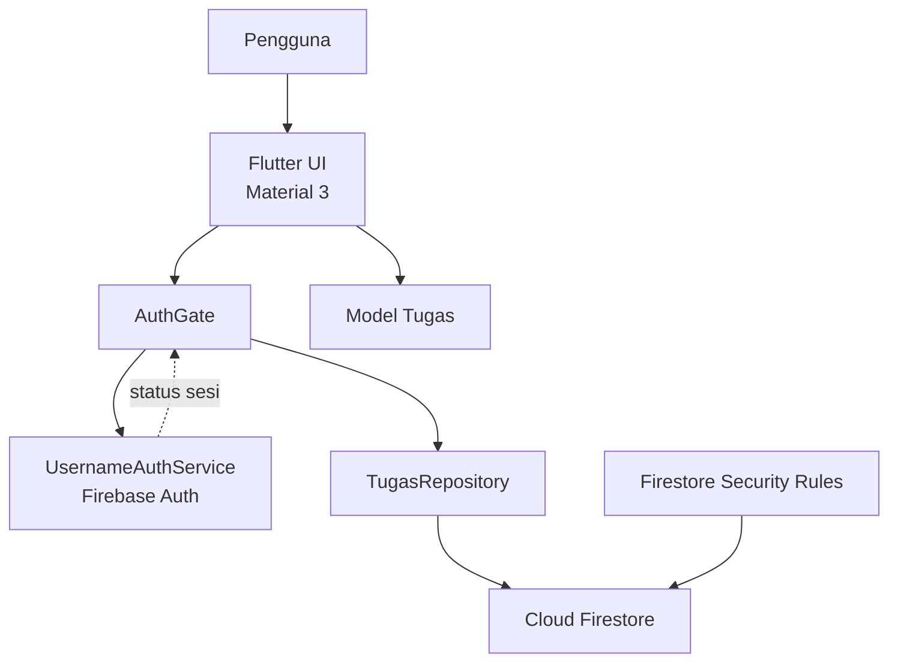

# Arsitektur Prioritas Tugas

Dokumen ini menjelaskan komponen yang digunakan oleh aplikasi Prioritas Tugas,
hubungan antar-komponen, serta batasan implementasi saat ini.

## Ringkasan

Prioritas Tugas adalah aplikasi Flutter untuk mengelola tugas kuliah secara
personal. Aplikasi mobile menangani antarmuka, autentikasi, logika tampilan,
dan akses data. Firebase digunakan sebagai backend aktif untuk autentikasi dan
penyimpanan tugas.



## Teknologi yang Digunakan

| Area | Teknologi | Peran |
| --- | --- | --- |
| Client | Flutter | Framework aplikasi lintas platform |
| Bahasa | Dart `^3.13.3` | Bahasa implementasi mobile |
| UI | Flutter Material 3 | Widget, tema, form, dan layout |
| Inisialisasi backend | `firebase_core` | Inisialisasi Firebase per platform |
| Autentikasi | `firebase_auth` | Registrasi, login, status sesi, dan logout |
| Database | `cloud_firestore` | Penyimpanan data tugas berbasis dokumen |
| Backend aktif | Firebase | Layanan autentikasi dan database yang dipanggil aplikasi |
| Testing | `flutter_test` | Widget test dan pengujian repository memory |
| Static analysis | `flutter_lints` | Linting dan pemeriksaan kode Dart |
| Backend scaffold | Prisma di `apps/api/prisma` | Kerangka migrasi database; belum dipakai oleh mobile |

`cupertino_icons` juga tersedia sebagai dependency Flutter, meskipun UI saat
ini menggunakan widget dan ikon Material.

## Struktur Repository

```text
.
├── apps/
│   ├── mobile/                 # Aplikasi Flutter utama
│   │   ├── lib/
│   │   │   ├── auth/           # Halaman dan service autentikasi
│   │   │   ├── data/           # Abstraksi dan implementasi repository
│   │   │   ├── models/         # Model domain Tugas
│   │   │   ├── main.dart       # Bootstrap aplikasi dan halaman utama
│   │   │   └── firebase_options.dart
│   │   ├── test/               # Widget test
│   │   ├── firestore.rules     # Aturan akses Cloud Firestore
│   │   └── pubspec.yaml        # Dependency dan konfigurasi Flutter
│   └── api/                    # Kerangka backend/database terpisah
│       └── prisma/migrations/ # Lokasi migrasi Prisma
├── packages/
│   └── shared/src/             # Lokasi package bersama, saat ini kosong
├── flutter/                    # Flutter SDK yang tersedia di workspace
├── README.md                   # Deskripsi produk dan ruang lingkup fitur
└── architecture.md             # Dokumentasi arsitektur ini
```

## Komponen Mobile

### Bootstrap dan navigasi awal

`apps/mobile/lib/main.dart` melakukan hal berikut:

1. Memastikan binding Flutter siap.
2. Menjalankan `Firebase.initializeApp` menggunakan `DefaultFirebaseOptions`.
3. Membuat `PrioritasTugasApp` dengan tema Material 3.
4. Menampilkan `AuthGate` sebagai halaman awal.

`AuthGate` mendengarkan `authStateChanges`. Saat sesi belum tersedia, pengguna
melihat `AuthPage`. Saat sesi tersedia, pengguna masuk ke `BerandaPage` dengan
`FirestoreTugasRepository`.

### Autentikasi

`UsernameAuthService` menyediakan API login, registrasi, logout, dan stream
perubahan sesi. Username dinormalisasi menjadi email internal dengan pola:

```text
<username>@prioritastugas.app
```

Dengan pendekatan ini, pengguna cukup memasukkan username dan password,
sementara Firebase Authentication tetap menggunakan provider Email/Password.

### Model domain

Model `Tugas` berada di `apps/mobile/lib/models/tugas.dart` dan memiliki data:

- `id`
- `nama`
- `mataKuliah`
- `deadline`
- `prioritas`
- `status`: `belum`, `dikerjakan`, atau `selesai`

Model menyediakan konversi `toMap` dan `fromMap` untuk pertukaran data dengan
Cloud Firestore.

### Akses data

`TugasRepository` adalah kontrak data yang menyediakan operasi:

- `getAll`
- `add`
- `update`
- `delete`

Implementasi yang tersedia:

- `FirestoreTugasRepository`: implementasi produksi menggunakan Firestore.
  Koleksi tugas berada pada `users/{uid}/tasks` dan semua operasi dikaitkan
  dengan pengguna Firebase yang sedang login.
- `MemoryTugasRepository`: implementasi in-memory untuk widget test atau
  pengembangan tanpa koneksi Firebase.

`BerandaPage` bergantung pada kontrak `TugasRepository`, bukan langsung pada
Firestore. Hal ini memungkinkan repository produksi diganti dengan repository
memory ketika testing.

## Penyimpanan Data

Dokumen tugas disimpan pada struktur berikut:

```text
users/
└── {firebaseUid}/
    └── tasks/
        └── {taskId}
            ├── nama: string
            ├── mataKuliah: string
            ├── deadline: timestamp
            ├── prioritas: number
            └── status: string
```

Saat mengambil daftar tugas, repository meminta Firestore mengurutkan data
berdasarkan `deadline`. Di sisi tampilan, daftar kemudian diurutkan berdasarkan
`prioritas` menurun; jika prioritas sama, `deadline` terdekat ditampilkan lebih
awal.

## Keamanan

`apps/mobile/firestore.rules` membatasi operasi pada dokumen tugas dengan dua
syarat:

1. Pengguna harus sudah terautentikasi.
2. `request.auth.uid` harus sama dengan `{userId}` pada path dokumen.

Dengan demikian, data tugas dipisahkan per akun dan pengguna tidak dapat
membaca atau mengubah koleksi milik pengguna lain melalui aturan Firestore.

## Alur Fitur Utama

### Login dan registrasi

```text
AuthPage
  -> UsernameAuthService
  -> Firebase Authentication
  -> authStateChanges
  -> AuthGate
  -> BerandaPage
```

### Membaca tugas

```text
BerandaPage.initState
  -> TugasRepository.getAll
  -> FirestoreTugasRepository
  -> users/{uid}/tasks
  -> daftar Tugas
  -> filter dan pengurutan di UI
```

### Menambah, mengubah status, dan menghapus tugas

Form pada `BerandaPage` mengubah objek `Tugas`, lalu memanggil operasi
repository yang sesuai. Repository menyimpan perubahan ke dokumen Firestore;
UI memperbarui daftar lokal setelah operasi berhasil.

## Testing dan Quality Gate

Test yang tersedia berada di `apps/mobile/test/widget_test.dart`. Test tersebut
menggunakan `MemoryTugasRepository` untuk memverifikasi bahwa beranda dapat
menampilkan judul aplikasi, tugas, dan tombol tambah tugas tanpa bergantung
pada jaringan atau Firebase.

Pemeriksaan lokal yang relevan:

```bash
cd apps/mobile
flutter analyze
flutter test
```

## Status Komponen yang Belum Aktif

- `apps/api/prisma` belum menjadi jalur backend aplikasi mobile. Belum ada
  service API yang dipanggil oleh client pada implementasi saat ini.
- `packages/shared/src` disiapkan untuk kode bersama, tetapi belum berisi
  model, validator, atau utility yang digunakan aplikasi.
- Sinkronisasi dengan layanan akademik, Google Calendar, chat, AI, dan fitur
  multi-perangkat berada di luar ruang lingkup aplikasi saat ini.

Jika API khusus nantinya diaktifkan, tanggung jawab akses data dapat dipindah
dari `FirestoreTugasRepository` ke repository HTTP/API tanpa mengubah kontrak
`TugasRepository` dan sebagian besar kode UI.